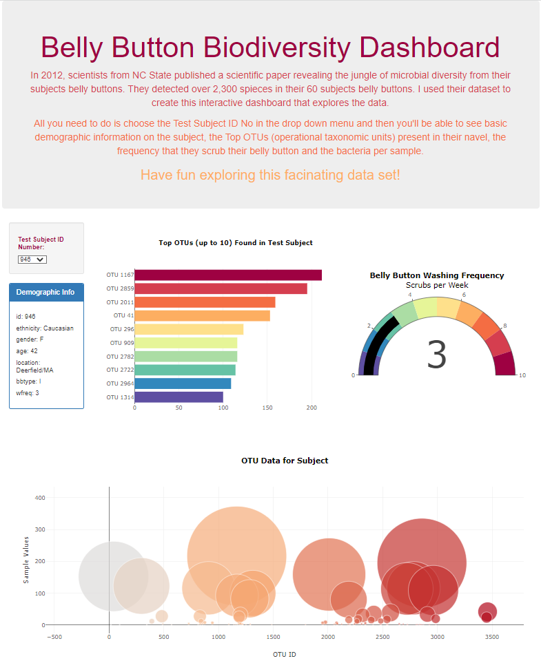

# belly-button-challenge
Module 14 Challenge for Laura Jordan

## Description
In this assignment, I built an interactive dashboard to explore a Belly Button Diversity dataset, which catalogs the microbes that colonize in human navels. 

The interactive dashboard includes:
* **Intro:** An intro section outlining basic information about the study
* **Subject ID Selector:** A drop down menu for the user to select the Test Subject ID Number that they want to see data for
* **Demographic Information:** Basic demographic information for the Subject 
* **Bar Chart:** A Horizontal Bar Chart that shows up to the top 10 OTUs found in the Subject
* **Gauge Chart:** A Guage Chart showing the frequency the Subject scrubbed their belly button
* **Bubble Chart:** A Bubble Chart showing the OTU data for the Subject

## Dashboard
To access the dashboard, please follow this link: https://laurajordan845.github.io/

**Dashboard Preview:** 

## Support
I attended class, rewatched zoom recordings of class, reviewed my notes, and did a ton of online research for this challenge assignment.

## Submission Includes 
* static/js folder which has the app.js file with my code
* index.html with the HTML code
* samples.json is the file with the initial dataset
